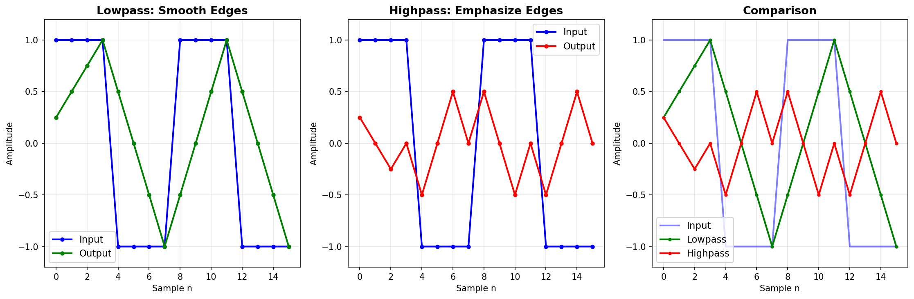

# AXI-Configurable FIR Filter

A runtime-configurable 4-tap FIR (Finite Impulse Response) filter with AXI4-Lite control interface and AXI4-Stream data path, implemented in SystemVerilog. Built during winter break to learn DSP fundamentals and industry-standard AXI protocols for satellite/defense applications.

## Overview

This project implements a digital FIR filter that can be reconfigured at runtime without recompiling hardware. Filter coefficients are set via AXI4-Lite memory-mapped registers, allowing the same hardware to perform lowpass, highpass, or other filtering operations by simply writing new coefficients through software.

**Key Features:**

- AXI4-Lite slave interface for coefficient configuration
- AXI4-Stream interfaces for high-throughput data flow
- Q1.15 fixed-point arithmetic for efficient FPGA implementation
- 3-stage pipelined architecture (shift register → multiply → accumulate)
- 1 sample/cycle throughput once pipeline is full
- 2-cycle latency from input to output
- Python golden model for verification

## Why FIR Filters?

FIR filters are fundamental in digital signal processing, especially for satellite communications and radar systems. They're used to:
- Remove noise from signals
- Isolate specific frequency bands

**Why FPGA implementation?** 

At sample rates of 10-100+ MHz, software processing can't keep up. FPGAs perform all multiplications in parallel, achieving much higher throughput.

## Filter Configurations

The same hardware supports different filter types by changing coefficients:

### Lowpass Filter (Default)
**Coefficients:** `h = [0.25, 0.25, 0.25, 0.25]`  
**Behavior:** Smooths rapid changes (high frequencies)  

### Highpass Filter
**Coefficients:** `h = [0.25, -0.25, -0.25, 0.25]`  
**Behavior:** Emphasizes edges and rapid changes  

## Design Decisions

### Fixed-Point Arithmetic (Q1.15)
I chose Q1.15 format because:
- Signals are typically normalized to ±1 range
- Provides 15 bits of fractional precision
- Fits in 16-bit datapath
- FPGA multipliers handle this efficiently

When multiplying two Q1.15 numbers, the result is Q2.30. I extract bits [30:15] to convert back to Q1.15, which is equivalent to shifting right by 15.

### Pipeline Architecture
The filter uses a 3-stage pipeline:
1. **Stage 1:** Shift register captures input samples
2. **Stage 2:** All 4 multipliers operate in parallel
3. **Stage 3:** Adder tree sums the products

**Why pipeline?** 

It allows higher clock frequencies and maintains 1 sample/cycle throughput once filled. The trickiest part was pipelining the valid signal. I initially forgot to propagate `valid` through the multiply stage, which caused `valid_out` to stay at 0.

### AXI4-Lite vs AXI4-Stream
- **AXI4-Lite:** Control plane - low bandwidth, memory-mapped register access
- **AXI4-Stream:** Data plane - high bandwidth, no addresses, pure streaming

## Register Map (AXI4-Lite)

| Address | Register       | Access | Description                    
|---------|----------------|--------|--------------------------------
| 0x00    | CTRL           | R/W    | Control register (bit 0: enable) 
| 0x04    | STATUS         | R      | Status (bit 0: idle)           
| 0x08    | NUM_TAPS       | R      | Number of taps (constant: 4)   
| 0x0C    | COEFF_0        | R/W    | Coefficient h[0] (Q1.15)       
| 0x10    | COEFF_1        | R/W    | Coefficient h[1] (Q1.15)       
| 0x14    | COEFF_2        | R/W    | Coefficient h[2] (Q1.15)       
| 0x18    | COEFF_3        | R/W    | Coefficient h[3] (Q1.15)       
| 0x1C    | SAMPLE_COUNT   | R      | Samples processed counter      

## Verification

### Test: Square Wave Input

**Input:** `[1, 1, 1, 1, -1, -1, -1, -1, ...]`

**Lowpass Output:**
```
Sample 0-3: 0.25, 0.50, 0.75, 1.00   (smooth ramp up)
Sample 4-7: 0.50, 0.00, -0.50, -1.00 (smooth ramp down)
```

**Highpass Output:**
```
Sample 0-3: 0.25, 0.00, -0.25, 0.00  (edges emphasized)
Sample 4-7: -0.50, 0.00, 0.50, 0.00  (constant regions → 0)
```

### Python Golden Model Comparison



The plot shows:
- **Left:** Lowpass filter smooths edges
- **Middle:** Highpass filter emphasizes edges
- **Right:** Direct comparison of both

## How to Run

### Simulation (Vivado)

1. Create new project in Vivado
2. Add design sources: `fir_config.sv`, `axi.sv`, `axi_stream.sv`
3. Add simulation source: `axi_stream_tb.sv`
4. Run behavioral simulation
5. Check console for output verification

### Python Golden Model
```bash
cd python/
python fir_golden_model.py
```

This will generate comparison plots and print expected outputs.

## Current Limitations

- **Fixed at 4 taps** - Could be parameterized for 8, 16, 32+ taps
- **Simple coefficients** - Uses moving average; could use proper filter design
- **Simulation only** - Not yet synthesized for actual FPGA

## What I Learned

I learned a lot about how AXI works and the basics of DSP. I also got to learn what a basic pipelined design looks like. Fun fact: I actually pipelined it by accident since I was splitting up the math into stages, which is how I thought about it, and that's why I had the issue with `valid`. 

## License

License: MIT; Feel free to use, but give credit
